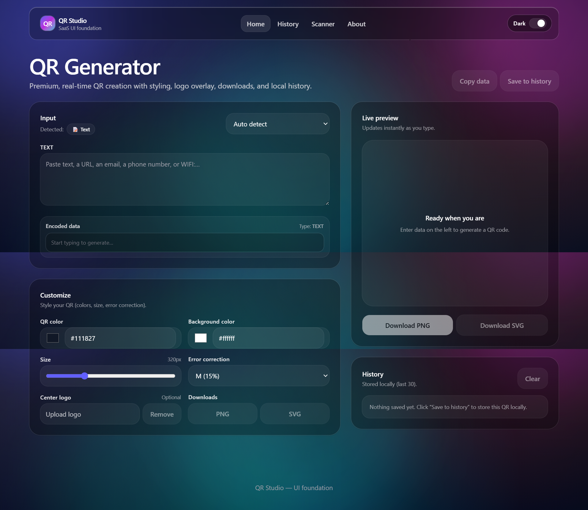
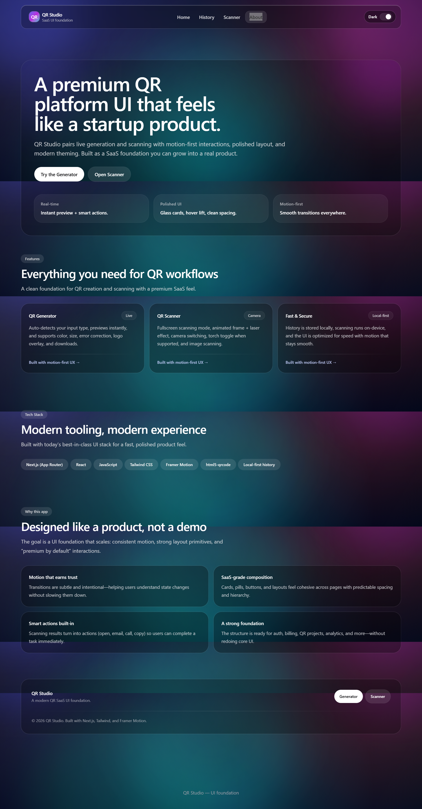
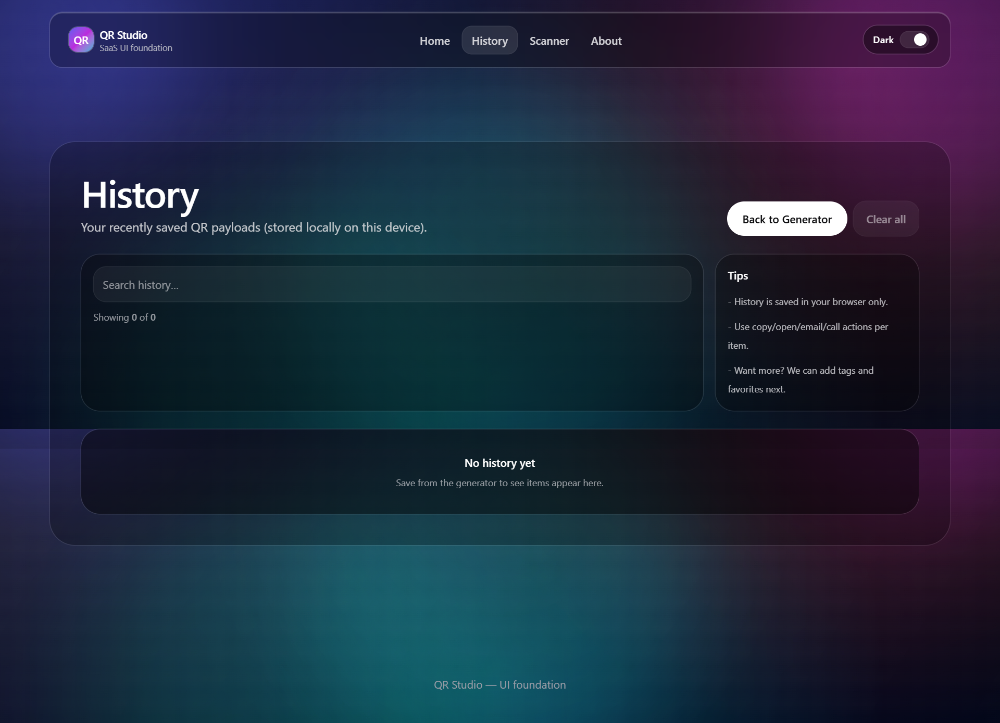
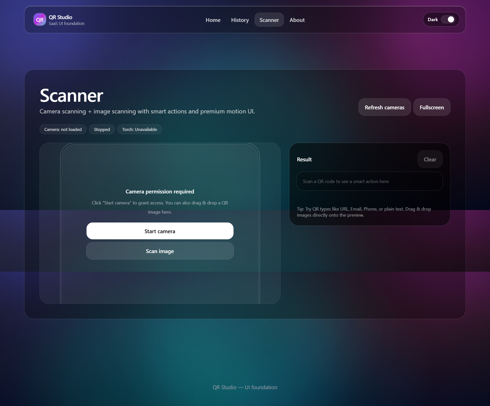
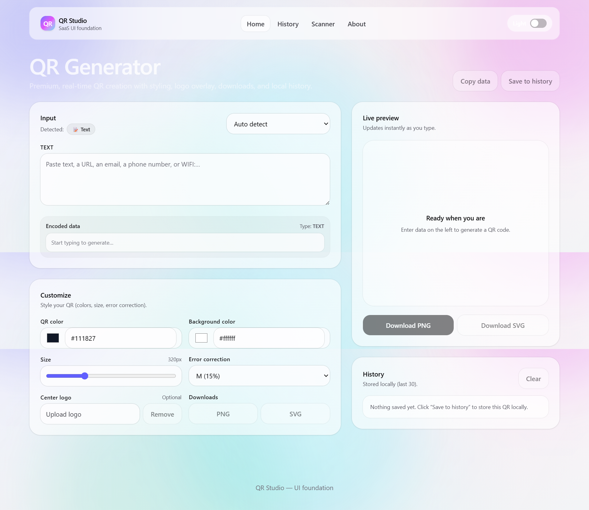
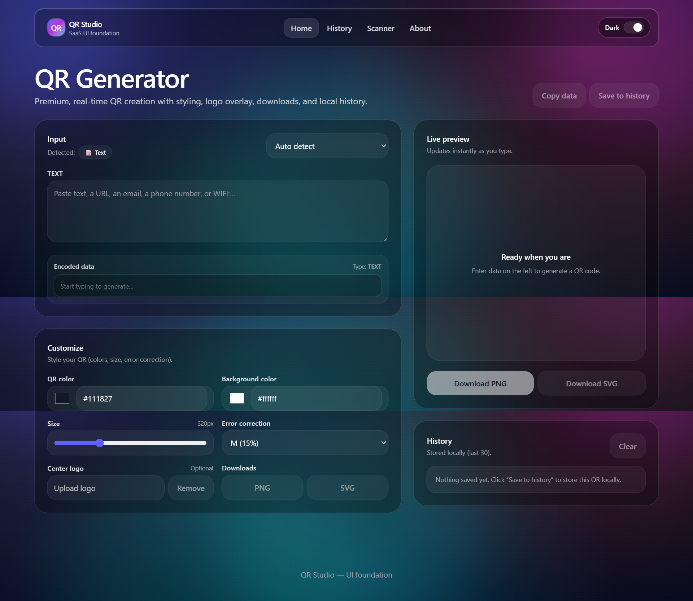

# 📱 QR Studio

A modern and feature-rich QR Code Generator & Scanner built with React. QR Studio allows users to generate, customize, scan, manage, and download QR codes through a beautiful, responsive, and user-friendly interface.

🔗 **Live Demo:** https://qr-studio-phi.vercel.app/

---

## 🚀 Features

### 🎨 QR Code Generator

* Generate QR codes instantly
* Real-time QR preview
* Customize QR colors
* Adjust QR size
* Add logo/image inside QR codes
* Download QR codes as images

### 📷 QR Code Scanner

* Scan QR codes directly from your device
* Fast and accurate QR detection
* Instant scan results

### 📜 QR History

* View previously generated QR codes
* Access past QR generations
* Better workflow management

### 🌙 Theme Support

* Dark Mode
* Light Mode
* Smooth theme switching

### 📱 Responsive Design

* Mobile-friendly UI
* Tablet support
* Desktop optimized
* Modern SaaS-inspired design

---

## 🛠️ Tech Stack

### Frontend

* React.js
* JavaScript (ES6+)
* Tailwind CSS

### Libraries

* QR Code Generator Library
* QR Scanner Library
* React Icons

### Deployment

* Vercel

---

## 📸 Project Screenshots

### 🏠 Home Page

<p align="center">
  
</p>

### ℹ️ About Page

<p align="center">
  
</p>

### 📜 History Page

<p align="center">
  
</p>

### 📷 Scanner Page

<p align="center">
  
</p>

### ☀️ Light Mode

<p align="center">
  
</p>

### 🌙 Dark Mode

<p align="center">
  
</p>

---

## 🚀 Key Highlights

* Modern and clean user interface
* Real-time QR code generation
* QR Scanner integration
* QR History management
* Dark & Light Mode support
* Responsive across all devices
* Reusable component architecture
* Production-ready deployment

---

## 💡 Problem Solved

QR Studio simplifies QR code generation and scanning by providing a single platform where users can:

* Generate custom QR codes
* Scan QR codes instantly
* Access QR generation history
* Download QR codes easily
* Use the application seamlessly across all devices

---

## 📂 Project Structure

```text
src/
├── components/
├── pages/
├── hooks/
├── context/
├── utils/
├── assets/
└── App.jsx
```

---

## 📚 What I Learned

Through this project, I improved my skills in:

* React Component Architecture
* State Management
* Responsive Design
* QR Code Generation
* QR Code Scanning
* Theme Management
* UI/UX Design
* Frontend Optimization
* Production Deployment

---

## 🔮 Future Improvements

### Planned Features

* Google Authentication
* User Accounts
* Cloud Database Integration
* QR Analytics Dashboard
* Bulk QR Generation
* QR Sharing System
* Saved Collections
* Export to Multiple Formats

---

## ⚙️ Installation

### Clone the Repository

```bash
git clone https://github.com/AzharAli-web/QR-Studio.git
```

### Navigate to Project Directory

```bash
cd QR-Studio
```

### Install Dependencies

```bash
npm install
```

### Start Development Server

```bash
npm run dev
```

---

## 👨‍💻 Author

### Azhar Ali

Frontend Developer | Full Stack JavaScript Developer

**GitHub:** https://github.com/AzharAli-web

**Portfolio:** https://azhar-digital-studio.vercel.app/

---

## ⭐ Support

If you found this project useful, consider giving it a star on GitHub.

Your support helps motivate future improvements and open-source contributions.
